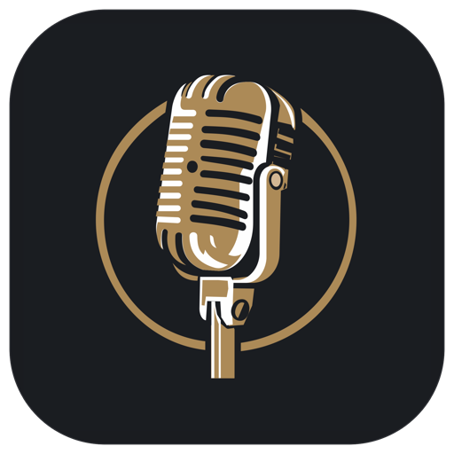
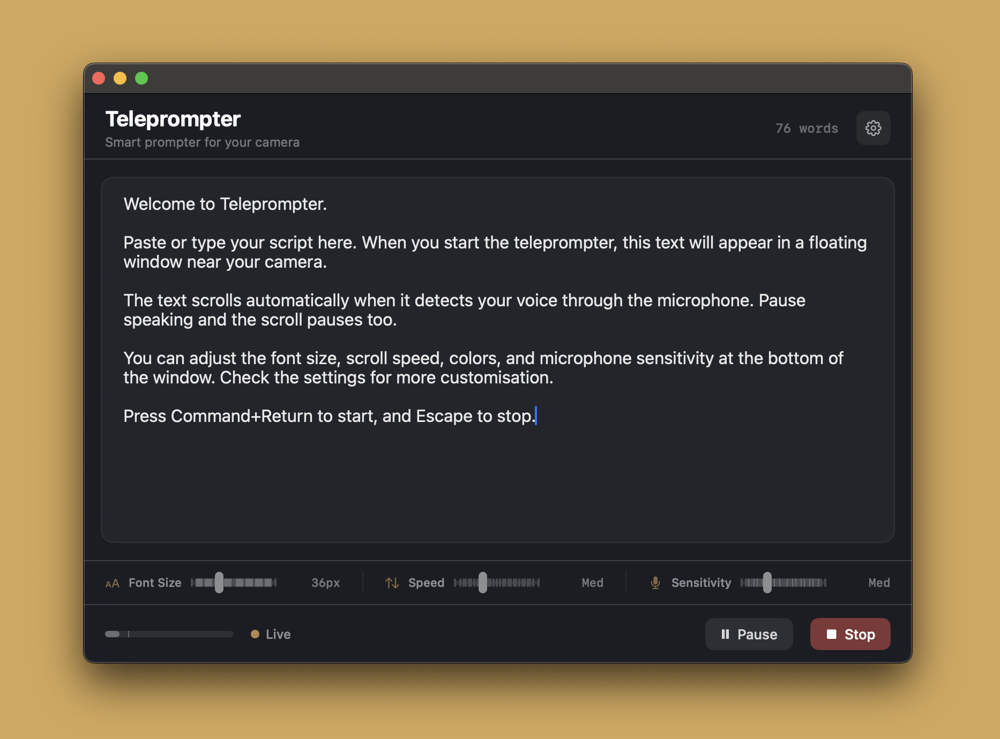

<p align="center">
  
</p>

<h1 align="center">Teleprompter</h1>

<p align="center">
  <strong>A free, native macOS teleprompter that listens to your voice.</strong><br>
  Speak naturally, maintain eye contact, and never lose your place again.
</p>

<p align="center">
  <a href="https://github.com/itsbirdo/teleprompter/releases/tag/v1.0.0">Download v1.0.0</a>
</p>

---

<p align="center">
  
</p>

Teleprompter is a lightweight Mac app that floats your script right next to your camera and scrolls it as you speak. It detects your voice through the microphone — talk and the text moves, pause and it waits. No foot pedals, no clickers, no second person needed. It stays invisible during screen sharing, so your audience sees your presentation while you stay on script. It's completely free, runs entirely offline, and takes about 30 seconds to set up.

## Download

**[Download the latest release](https://github.com/itsbirdo/teleprompter/releases/tag/v1.0.0)** — available as `.dmg`, `.pkg`, or `.zip`.

Requires macOS 14.0+ (Sonoma). Works on Apple Silicon and Intel.

> On first launch, right-click the app and select **Open** (the app is ad-hoc signed, not notarized with Apple).

## Features

### Voice-Activated Scrolling
The app monitors your microphone and detects when you're speaking. The script scrolls forward while you talk and pauses when you stop. The detection uses smoothed audio levels with a hold timer to bridge natural pauses between words, so scrolling feels fluid rather than jittery.

### Camera-Positioned Display
The teleprompter appears as a floating panel anchored to the top-center of your screen, right where your camera is. On MacBooks with a notch, it sits just below the camera — letting you read while looking directly into the lens.

### Screen Share Invisible
The teleprompter window is completely invisible to screen capture, screen recording, and screen sharing. Your audience sees your slides or app, not your script.

### Inline Controls
Font size, scroll speed, and microphone sensitivity are adjustable directly in the main window — no digging through menus to get things dialled in.

### Customizable Appearance
- **Font size** — 16px to 80px, adjustable inline or with `+`/`-` keys during prompting
- **Text color** — full color picker
- **Window opacity** — 50% to 100%
- **Window size** — adjustable width and height
- **Mirror text** — horizontal flip for physical teleprompter rigs

### Countdown Timer
A configurable countdown (0–10 seconds) gives you time to get ready before scrolling begins.

### Script Editor
Type or paste your text in the built-in editor. Scripts are auto-saved between sessions. Open and save `.txt` files via the File menu.

### Audio Level Indicator
A real-time audio level bar shows your microphone input and the detection threshold, so you can see exactly when your voice is triggering the scroll.

## Keyboard Shortcuts

| Action | Shortcut |
|---|---|
| Start Teleprompter | `Cmd + Return` |
| Stop Teleprompter | `Escape` |
| Pause / Resume | `Space` |
| Scroll Up | `Up Arrow` |
| Scroll Down | `Down Arrow` |
| Increase Font Size | `+` |
| Decrease Font Size | `-` |
| New Script | `Cmd + N` |
| Open Script | `Cmd + O` |
| Save Script | `Cmd + S` |

## Building from Source

The project compiles with no dependencies beyond the macOS SDK. No Xcode project required — just the Command Line Tools (`xcode-select --install`).

```bash
./build.sh
open build/Teleprompter.app
```

## Project Structure

```
teleprompter/
├── Sources/
│   ├── TeleprompterApp.swift          # App entry point and menu commands
│   ├── AppState.swift                 # Central state management and scroll logic
│   ├── MainView.swift                 # Main window: script editor and controls
│   ├── TeleprompterView.swift         # Floating prompter content view
│   ├── SettingsView.swift             # Settings sheet
│   ├── FloatingPanel.swift            # NSPanel subclass (always-on-top, share-invisible)
│   ├── TeleprompterPanelController.swift  # Creates and manages the floating panel
│   ├── AudioMonitor.swift             # AVAudioEngine mic level monitoring
│   ├── AudioLevelIndicator.swift      # Audio level bar view
│   ├── CountdownView.swift            # Countdown overlay
│   └── Extensions.swift              # Color hex utilities
├── Resources/
│   ├── Info.plist                     # App metadata and permissions
│   └── Teleprompter.entitlements      # Microphone entitlement
├── generate_icon.swift                # Generates app icon via Core Graphics
├── build.sh                           # Build script
├── package.sh                         # Creates .dmg, .pkg, and .zip
└── README.md
```

## How It Works

**Voice Detection** — `AVAudioEngine` taps the microphone input. Raw RMS levels are boosted through a power curve to amplify quiet speech, then smoothed with an asymmetric exponential moving average. A short hold timer keeps scrolling active through natural word gaps.

**Scroll Mechanics** — A 60fps timer drives the scroll offset. Velocity eases in and out smoothly rather than snapping between moving and stopped.

**Floating Window** — The teleprompter uses `NSPanel` with `.nonactivatingPanel` so it doesn't steal focus. It floats above all windows, shows on all Spaces, and `sharingType = .none` makes it invisible to screen capture.

## Privacy

Everything runs locally. Scripts are stored in `UserDefaults` on your machine. Audio from the microphone is analyzed in real-time for volume levels only — nothing is recorded, stored, or transmitted. There are no network requests, no analytics, no telemetry. Zero data leaves your computer.

## License

MIT
